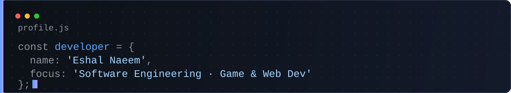

  <!-- Animated Top Border Line -->
  

   

  

  

  
  

---

## 🌱 About Me

* 🎓 **Software Engineering Student**
* 🎮 **Aspiring Game Developer**
* 🌐 **Aspiring Web Developer**
* 💻 Currently learning and building projects with **C++, Java, Python, HTML, CSS & JavaScript**
* 🚀 Interested in software development, web development, and game development
* 📫 Reach me at **[eshalnaeem2008@gmail.com](mailto:eshalnaeem2008@gmail.com)**

---

### 🛠️ Languages & Frameworks

### 🧰 Tools & Environments

---

## 📊 GitHub Analytics

---

## 📈 Contribution Activity

  

---

---

### 📫 Connect with Me

  <i>✨ Learning, building, and growing — one project at a time.</i>

  Thanks for stopping by — feel free to explore my repos ⭐

  

<!-- Animated Bottom Border Line -->

